# CD12352 - Infrastructure as Code Project Solution
### Project by: Manjunath S C P

## Spin up instructions

### Powershell Scripts Commands:

    .\runners\create.ps1 network-udagram .\network_config\network.yml .\network_config\network-parameters.json
    .\runners\create.ps1 s3-udagram .\s3_config\s3.yml .\s3_config\s3-parameters.json
    .\runners\create.ps1 main-udagram .\udagram_config\udagram.yml .\udagram_config\udagram-parameters.json

### Alternative Python script:

Pre-requisite: 
    
    aws configure

Execution Commands:

    python .\cloud_formation.py create --stack-name network-udagram --template-path ./network_config/network.yml --parameters-path ./network_config/network-parameters.json
    python .\cloud_formation.py create --stack-name s3-udagram --template-path ./s3_config/s3.yml --parameters-path ./s3_config/s3-parameters.json
    python .\cloud_formation.py create --stack-name main-udagram --template-path ./udagram_config/udagram.yml --parameters-path ./udagram_config/udagram-parameters.json

## Tear down instructions
### Powershell Scripts Commands:

    .\runners\delete.ps1 main-udagram
    .\runners\delete.ps1 s3-udagram
    .\runners\delete.ps1 network-udagram

### Alternative Python script:

    python .\cloud_formation.py delete --stack-name main-udagram
    python .\cloud_formation.py delete --stack-name s3-udagram
    python .\cloud_formation.py delete --stack-name network-udagram

## Other considerations
TODO (optional)

## Exercise Details
### 1. Architecture Diagram

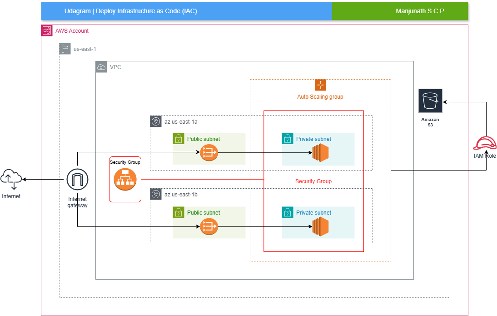

### 2. CloudFormation Creation

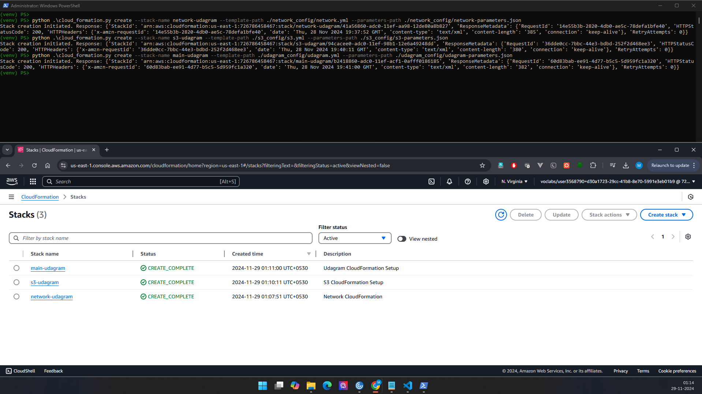

### 3. Network Resources

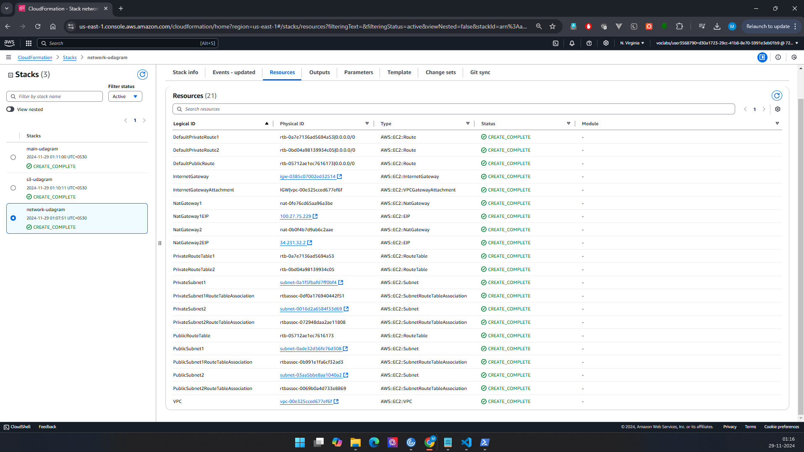

### 4. Network Outputs

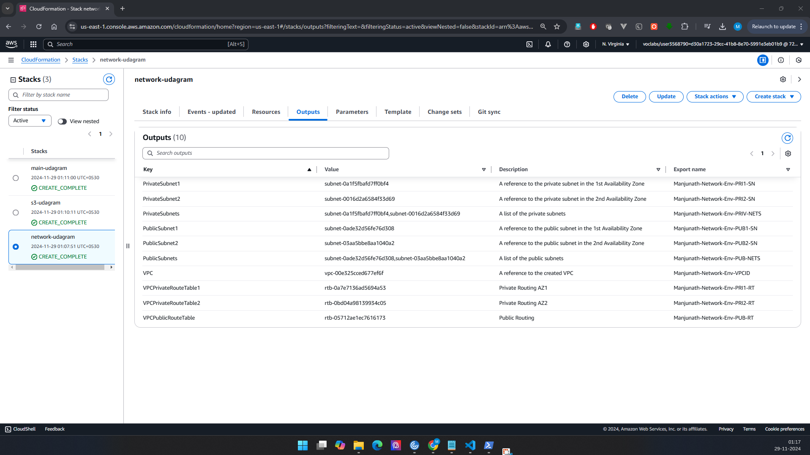

### 5. Udagram Resources

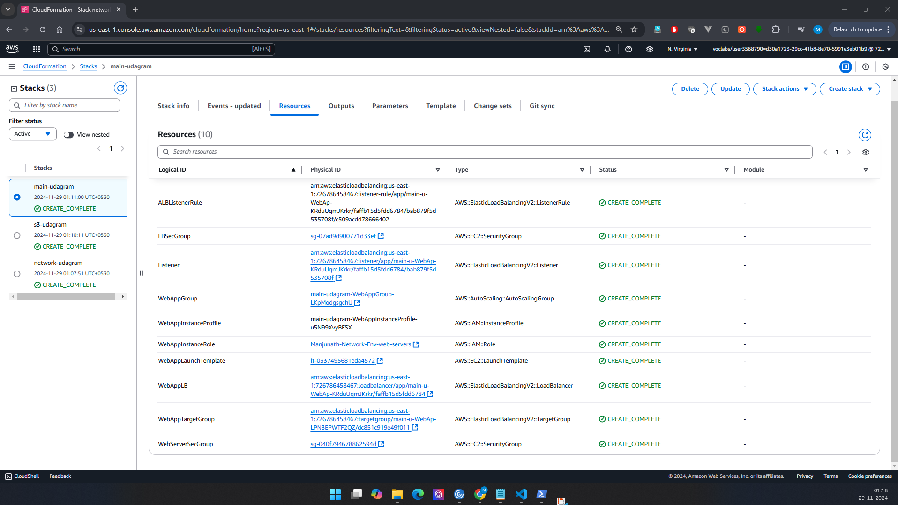

### 6. Udagram Outputs

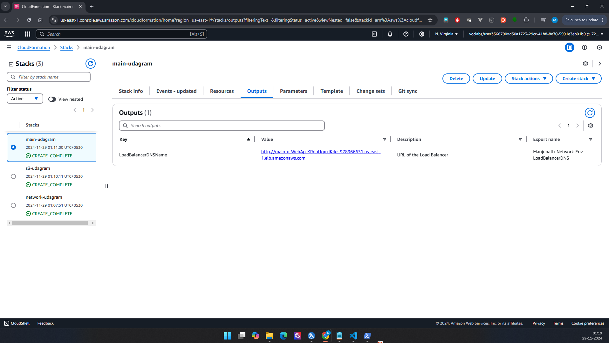

### 7. VPC Config - GUI

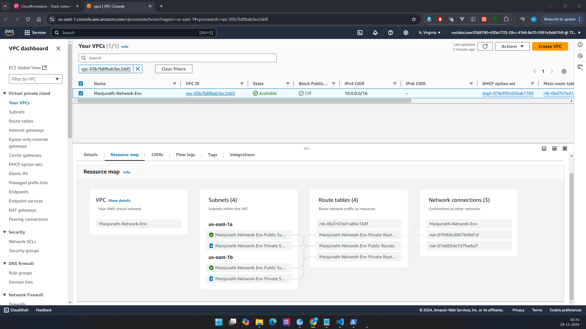

### 8. Auto Scaling Config - GUI

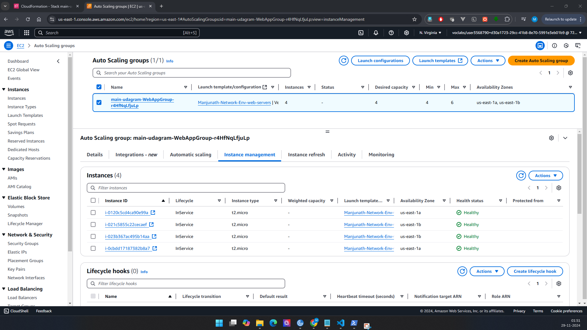

### 9. Health Checks - GUI

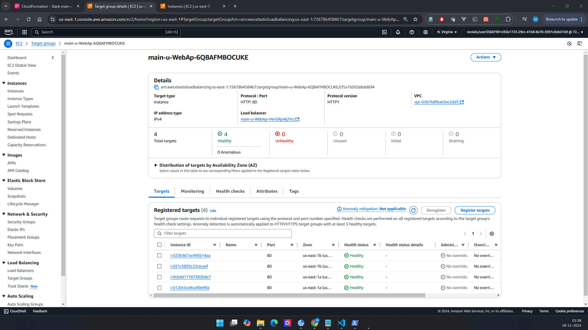

### 10. Final DNS Snapshot

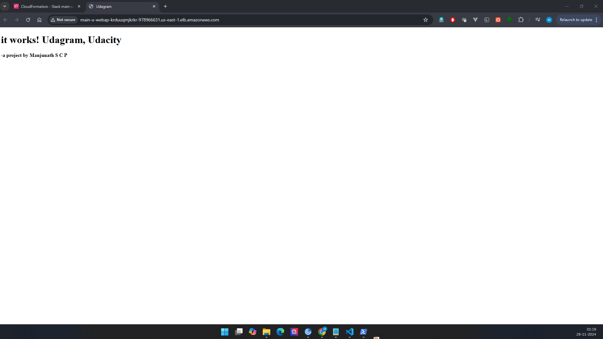

### 11. Tear Down

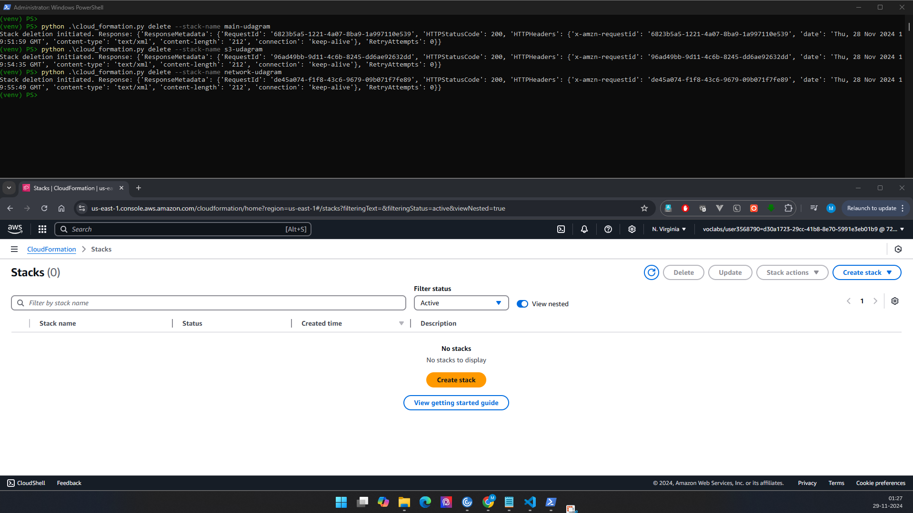

